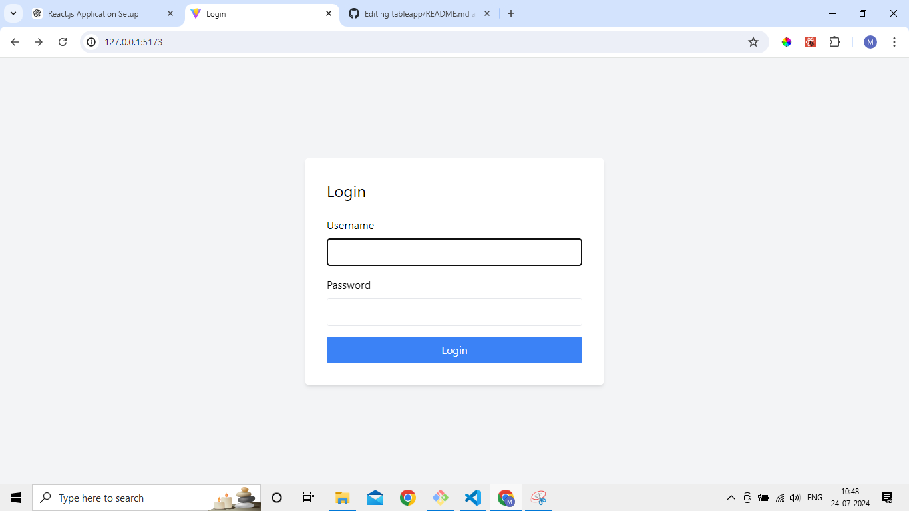
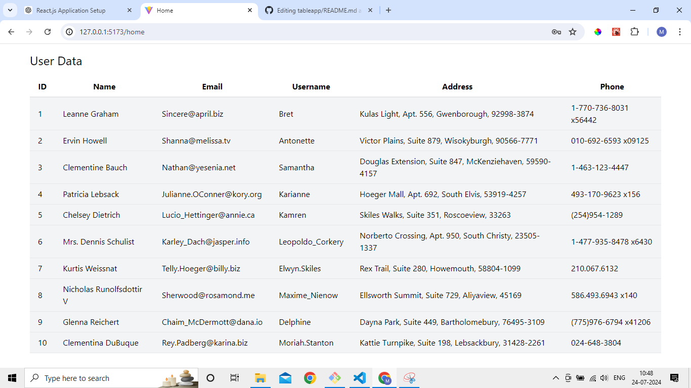

# React Application

This is a simple React application that includes a login page and fetches data from a public API to display in a responsive table format.

## Features

- Login page with basic validation
- Fetch data from JSONPlaceholder API
- Display data in a responsive table

## Setup

1. Clone the repository.
2. Run `npm install` to install dependencies.
3. Run `npm run dev` to start the application.

## Screenshot

